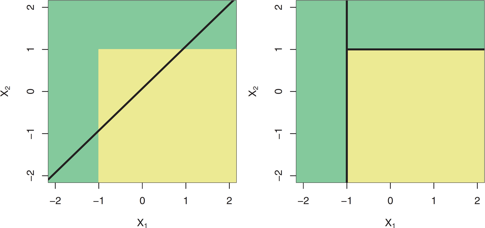

exclude: true

```{r, setup, include = F}
library(pacman)
p_load(
  ISLR,
  broom, tidyverse,
  ggplot2, ggthemes, ggforce, ggridges, cowplot, scales,
  latex2exp, viridis, extrafont, gridExtra, plotly, ggformula,
  DiagrammeR,
  kableExtra, DT, huxtable,
  data.table, dplyr, snakecase, janitor,
  lubridate, knitr,
  caret, tidymodels, rpart, rpart.plot, rattle,
  here, magrittr, parallel
)
# Define colors
red_pink   = "#e64173"
turquoise  = "#20B2AA"
orange     = "#FFA500"
red        = "#fb6107"
blue       = "#3b3b9a"
green      = "#8bb174"
grey_light = "grey70"
grey_mid   = "grey50"
grey_dark  = "grey20"
purple     = "#6A5ACD"
slate      = "#314f4f"
# Knitr options
opts_chunk$set(
  comment = "#>",
  fig.align = "center",
  fig.height = 7,
  fig.width = 10.5,
  warning = F,
  message = F
)
opts_chunk$set(dev = "svg")
options(device = function(file, width, height) {
  svg(tempfile(), width = width, height = height)
})
options(knitr.table.format = "html")
# A few extras
xaringanExtra::use_xaringan_extra(c("tile_view", "fit_screen"))
```

---
layout: true
# Admin

---
class: inverse, middle

---
name: admin-today
## Material

.note[Last time:] Classification

.note[Today!] Decision trees for regression and classification.

---
name: admin-soon

## Upcoming

.b[Readings]
- .note[Today] .it[ISL] Ch. 8.1
- .note[Next] .it[ISL] Ch. 8.2

.b[Problem sets]
- .it[Penalized regression and classification:] Soon!
- Let Andrew know if you resubmit

.b[Project] See updated dates.

.b[Office hours] Will be moved next week (2/15).

---
class: clear, middle

```{r, workshop, echo = F, out.width = '90%'}
magick::image_read('images/algorithmic-bias.png')
```

Register in advance with Paul Showler ([pauls@uoregon.edu](mailto:pauls@uoregon.edu)).
<br>Include your name, position title, and campus affiliation.


---
layout: true
# Decision trees

---
class: inverse, middle

---
name: fundamentals
## Fundamentals

.attn[Decision trees]
- split the .it[predictor space] (our $\mathbf{X}$) into regions
- then predict the most-common value within a region

--

.attn[Decision trees]
1. work for .hi[both classification and regression]

--
1. are inherently .hi[nonlinear]

--
1. are relatively .hi[simple] and  .hi[interpretable]

--
1. often .hi[underperform] relative to competing methods

--
1. easily extend to .hi[very competitive ensemble methods] (*many* trees).super[🌲]

.footnote[
🌲 Though the ensembles will be much less interpretable.
]

---
layout: true
class: clear

---
exclude: true

```{r, data-default, include = F}
# Load 'Defualt' data from 'ISLR'
default_df = ISLR::Default %>% as_tibble()
```

---
.ex[Example:] .b[A simple decision tree] classifying credit-card default

```{r, tree-graph, echo = F, cache = T}
DiagrammeR::grViz("
digraph {

graph [layout = dot, overlap = false, fontsize = 14]

node [shape = oval, fontname = 'Fira Sans', color = Gray95, style = filled]
s1 [label = 'Bal. > 1,800']
s2 [label = 'Bal. < 1,972']
s3 [label = 'Inc. > 27K']

node [shape = egg, fontname = 'Fira Sans', color = Purple, style = filled, fontcolor = White]
l1 [label = 'No (98%)']
l4 [label = 'No (69%)']

node [shape = egg, fontname = 'Fira Sans', color = Orange, style = filled, fontcolor = White]
l2 [label = 'Yes (76%)']
l3 [label = 'Yes (59%)']

edge [fontname = 'Fira Sans', color = Grey70]
s1 -> l1 [label = 'F']
s1 -> s2 [label = 'T']
s2 -> s3 [label = 'T']
s2 -> l2 [label = 'F']
s3 -> l3 [label = 'T']
s3 -> l4 [label = 'F']
}
")
```

---
name: ex-partition

Let's see how the tree works
--
—starting with our data (default: .orange[Yes] .it[vs.] .purple[No]).

```{r, partition-base, include = F, cache = T}
gg_base = ggplot(
  data = default_df,
  aes(x = balance, y = income, color = default, alpha = default)
) +
geom_hline(yintercept = 0) +
geom_vline(xintercept = 0) +
geom_point(size = 2) +
scale_y_continuous("Income", labels = dollar) +
scale_x_continuous("Balance", labels = dollar) +
scale_color_manual("Defaulted:", values = c(purple, orange), labels = c("No", "Yes")) +
scale_alpha_manual("Defaulted:", values = c(0.1, 0.8), labels = c("No", "Yes")) +
theme_minimal(base_size = 20, base_family = "Fira Sans Book") +
theme(legend.position = "none")
```

```{r, plot-raw, echo = F}
gg_base
```

---

The .hi-pink[first partition] splits balance at $1,800.

```{r, plot-split1, echo = F, cache = T, dependson = c(-2)}
# Add the first split (to existing figure)
gg_base +
annotate(
  "segment",
  x = 1800, xend = 1800, y = -Inf, yend = Inf,
  color = red_pink, size = 1.2
)
```
---

The .hi-pink[second partition] splits balance at $1,972, (.it[conditional on bal. > $1,800]).

```{r, plot-split2, echo = F, cache = T, dependson = c(-3)}
gg_base +
annotate(
  "segment",
  x = 1800, xend = 1800, y = -Inf, yend = Inf,
  linetype = "longdash"
) +
annotate(
  "segment",
  x = 1972, xend = 1972, y = -Inf, yend = Inf,
  color = red_pink, size = 1.2
)
```
---

The .hi-pink[third partition] splits income at $27K .b[for] bal. between $1,800 and $1,972.

```{r, plot-split3, echo = F, cache = T, dependson = c(-4)}
gg_base +
annotate(
  "segment",
  x = 1800, xend = 1800, y = -Inf, yend = Inf,
  linetype = "longdash"
) +
annotate(
  "segment",
  x = 1972, xend = 1972, y = -Inf, yend = Inf,
  linetype = "longdash"
) +
annotate(
  "segment",
  x = 1800, xend = 1972, y = 27e3, yend = 27e3,
  color = red_pink, size = 1.2
)
```

---

These three partitions give us four .b[regions]...

```{r, plot-split3b, echo = F, cache = T, dependson = c(-5)}
gg_base +
annotate(
  "segment",
  x = 1800, xend = 1800, y = -Inf, yend = Inf,
  linetype = "longdash"
) +
annotate(
  "segment",
  x = 1972, xend = 1972, y = -Inf, yend = Inf,
  linetype = "longdash"
) +
annotate(
  "segment",
  x = 1800, xend = 1972, y = 27e3, yend = 27e3,
  linetype = "longdash"
) +
annotate("text",
  x = 900, y = 37500, label = expression(R[1]),
  size = 8, family = "Fira Sans Book"
) +
annotate("text",
  x = 1886, y = 5.1e4, label = expression(R[2]),
  size = 8, family = "Fira Sans Book"
) +
annotate("text",
  x = 1886, y = 1e4, label = expression(R[3]),
  size = 8, family = "Fira Sans Book"
) +
annotate("text",
  x = 2336, y = 37500, label = expression(R[4]),
  size = 8, family = "Fira Sans Book"
)
```
---

.b[Predictions] cover each region (_e.g._, using the region's most common class).

```{r, plot-split3c, echo = F, cache = T, dependson = c(-6)}
gg_base +
annotate(
  "rect",
  xmin = 0, xmax = 1800, ymin = 0, ymax = Inf,
  fill = purple, alpha = 0.3
) +
annotate(
  "segment",
  x = 1800, xend = 1800, y = -Inf, yend = Inf,
  linetype = "longdash"
) +
annotate(
  "segment",
  x = 1972, xend = 1972, y = -Inf, yend = Inf,
  linetype = "longdash"
) +
annotate(
  "segment",
  x = 1800, xend = 1972, y = 27e3, yend = 27e3,
  linetype = "longdash"
)
```
---

.b[Predictions] cover each region (_e.g._, using the region's most common class).

```{r, plot-split3d, echo = F, cache = T, dependson = c(-7)}
gg_base +
annotate(
  "rect",
  xmin = 0, xmax = 1800, ymin = 0, ymax = Inf,
  fill = purple, alpha = 0.3
) +
annotate(
  "rect",
  xmin = 1800, xmax = 1972, ymin = 27e3, ymax = Inf,
  fill = orange, alpha = 0.3
) +
annotate(
  "segment",
  x = 1800, xend = 1800, y = -Inf, yend = Inf,
  linetype = "longdash"
) +
annotate(
  "segment",
  x = 1972, xend = 1972, y = -Inf, yend = Inf,
  linetype = "longdash"
) +
annotate(
  "segment",
  x = 1800, xend = 1972, y = 27e3, yend = 27e3,
  linetype = "longdash"
)
```
---

.b[Predictions] cover each region (_e.g._, using the region's most common class).

```{r, plot-split3e, echo = F, cache = T, dependson = c(-8)}
gg_base +
annotate(
  "rect",
  xmin = 0, xmax = 1800, ymin = 0, ymax = Inf,
  fill = purple, alpha = 0.3
) +
annotate(
  "rect",
  xmin = 1800, xmax = 1972, ymin = 27e3, ymax = Inf,
  fill = orange, alpha = 0.3
) +
annotate(
  "rect",
  xmin = 1800, xmax = 1972, ymin = 0, ymax = 27e3,
  fill = purple, alpha = 0.3
) +
annotate(
  "segment",
  x = 1800, xend = 1800, y = -Inf, yend = Inf,
  linetype = "longdash"
) +
annotate(
  "segment",
  x = 1972, xend = 1972, y = -Inf, yend = Inf,
  linetype = "longdash"
) +
annotate(
  "segment",
  x = 1800, xend = 1972, y = 27e3, yend = 27e3,
  linetype = "longdash"
)
```
---

.b[Predictions] cover each region (_e.g._, using the region's most common class).

```{r, plot-split3f, echo = F, cache = T, dependson = c(-9)}
gg_base +
annotate(
  "rect",
  xmin = 0, xmax = 1800, ymin = 0, ymax = Inf,
  fill = purple, alpha = 0.3
) +
annotate(
  "rect",
  xmin = 1800, xmax = 1972, ymin = 27e3, ymax = Inf,
  fill = orange, alpha = 0.3
) +
annotate(
  "rect",
  xmin = 1800, xmax = 1972, ymin = 0, ymax = 27e3,
  fill = purple, alpha = 0.3
) +
annotate(
  "rect",
  xmin = 1972, xmax = Inf, ymin = 0, ymax = Inf,
  fill = orange, alpha = 0.3
) +
annotate(
  "segment",
  x = 1800, xend = 1800, y = -Inf, yend = Inf,
  linetype = "longdash"
) +
annotate(
  "segment",
  x = 1972, xend = 1972, y = -Inf, yend = Inf,
  linetype = "longdash"
) +
annotate(
  "segment",
  x = 1800, xend = 1972, y = 27e3, yend = 27e3,
  linetype = "longdash"
)
```

---
name: defn

The .hi-pink[regions] correspond to the tree's .attn[terminal nodes] (or .attn[leaves]).

```{r, tree-leaves, echo = F, cache = T}
DiagrammeR::grViz("
digraph {

graph [layout = dot, overlap = false, fontsize = 14]

node [shape = oval, fontname = 'Fira Sans', color = Gray95, style = filled]
s1 [label = 'Bal. > 1,800']
s2 [label = 'Bal. < 1,972']
s3 [label = 'Inc. > 27K']

node [shape = egg, fontname = 'Fira Sans', color = DeepPink, style = filled, fontcolor = White]
l1 [label = 'No (98%)']
l4 [label = 'No (69%)']

node [shape = egg, fontname = 'Fira Sans', color = DeepPink, style = filled, fontcolor = White]
l2 [label = 'Yes (76%)']
l3 [label = 'Yes (59%)']

edge [fontname = 'Fira Sans', color = Grey70]
s1 -> l1 [label = 'F']
s1 -> s2 [label = 'T']
s2 -> s3 [label = 'T']
s2 -> l2 [label = 'F']
s3 -> l3 [label = 'T']
s3 -> l4 [label = 'F']
}
")
```
---

The graph's .hi-pink[separating lines] correspond to the tree's .attn[internal nodes].

```{r, tree-internal, echo = F, cache = T}
DiagrammeR::grViz("
digraph {

graph [layout = dot, overlap = false, fontsize = 14]

node [shape = oval, fontname = 'Fira Sans', color = DeepPink, style = filled, fontcolor = White]
s1 [label = 'Bal. > 1,800']
s2 [label = 'Bal. < 1,972']
s3 [label = 'Inc. > 27K']

node [shape = egg, fontname = 'Fira Sans', color = Grey95, style = filled, fontcolor = White]
l1 [label = 'No (98%)']
l4 [label = 'No (69%)']

node [shape = egg, fontname = 'Fira Sans', color = Grey95, style = filled, fontcolor = White]
l2 [label = 'Yes (76%)']
l3 [label = 'Yes (59%)']

edge [fontname = 'Fira Sans', color = Grey70]
s1 -> l1 [label = 'F']
s1 -> s2 [label = 'T']
s2 -> s3 [label = 'T']
s2 -> l2 [label = 'F']
s3 -> l3 [label = 'T']
s3 -> l4 [label = 'F']
}
")
```
---

The segments connecting the nodes within the tree are its .attn[branches].

```{r, tree-branches, echo = F, cache = T}
DiagrammeR::grViz("
digraph {

graph [layout = dot, overlap = false, fontsize = 14]

node [shape = oval, fontname = 'Fira Sans', color = Grey95, style = filled, fontcolor = White]
s1 [label = 'Bal. > 1,800']
s2 [label = 'Bal. < 1,972']
s3 [label = 'Inc. > 27K']

node [shape = egg, fontname = 'Fira Sans', color = Grey95, style = filled, fontcolor = White]
l1 [label = 'No (98%)']
l4 [label = 'No (69%)']

node [shape = egg, fontname = 'Fira Sans', color = Grey95, style = filled, fontcolor = White]
l2 [label = 'Yes (76%)']
l3 [label = 'Yes (59%)']

edge [fontname = 'Fira Sans', color = DeepPink]
s1 -> l1 [label = 'F']
s1 -> s2 [label = 'T']
s2 -> s3 [label = 'T']
s2 -> l2 [label = 'F']
s3 -> l3 [label = 'T']
s3 -> l4 [label = 'F']
}
")
```

---
class: middle

You now know the anatomy of a decision tree.

But where do trees come from—how do we train.super[🌲] a tree?

.footnote[
🌲 grow
]

---
layout: true
# Decision trees

---
name: growth
## Growing trees

We will start with .attn[regression trees], _i.e._, trees used in regression settings.

--

As we saw, the task of .hi[growing a tree] involves two main steps:

1. .b[Divide the predictor space] into $J$ regions (using predictors $\mathbf{x}_1,\ldots,\mathbf{x}_p$)

--

1. .b[Make predictions] using the regions' mean outcome.
<br>For region $R_j$ predict $\hat{y}_{R_j}$ where
$$
\begin{align}
  \hat{y}_{R_j} = \frac{1}{n_j} \sum_{i\in R_j} y
\end{align}
$$

---
## Growing trees

We .hi[choose the regions to minimize RSS] .it[across all] $J$ .note[regions], _i.e._,
$$
\begin{align}
  \sum_{j=1}^{J} \left( y_i - \hat{y}_{R_j} \right)^2
\end{align}
$$

--

.b[Problem:] Examining every possible partition is computationally infeasible.

--

.b[Solution:] a .it[top-down, greedy] algorithm named .attn[recursive binary splitting]
- .attn[recursive] start with the "best" split, then find the next "best" split, ...
- .attn[binary] each split creates two branches—"yes" and "no"
- .attn[greedy] each step makes .it[best] split—no consideration of overall process

---
## Growing trees: Choosing a split

.ex[Recall] Regression trees choose the split that minimizes RSS.

To find this split, we need

1. a .purple[predictor], $\color{#6A5ACD}{\mathbf{x}_j}$
1. a .attn[cutoff] $\color{#e64173}{s}$ that splits $\color{#6A5ACD}{\mathbf{x}_j}$ into two parts: (1) $\color{#6A5ACD}{\mathbf{x}_j} < \color{#e64173}{s}$ and (2) $\color{#6A5ACD}{\mathbf{x}_j} \ge \color{#e64173}{s}$

--

Searching across each of our .purple[predictors] $\color{#6A5ACD}{j}$ and all of their .pink[cutoffs] $\color{#e64173}{s}$,
<br>we choose the combination that .b[minimizes RSS].

---
layout: true
# Decision trees
## Example: Splitting

---
name: ex-split

.ex[Example] Consider the dataset

```{r, data-ex-split, echo = F}
ex_df = tibble(
  "i" = 1:3,
  "pred." = c(0, 0, 0),
  "y" = c(0, 8, 6),
  "x.sub[1]" = c(1, 3, 5),
  "x.sub[2]" = c(4, 2, 6)
)
ex_df %>%
  hux() %>%
  set_align(1:4, 1:5, "center") %>%
  set_bold(1, 1:5, T) %>%
  set_bold(2:4, 1:5, F) %>%
  set_bottom_border(1, c(1,3:5), 1) %>%
  set_text_color(1:4, 2, "white") %>% 
  set_width(0.5)
```

--

With just three observations, each variable only has two actual splits..super[🌲]

.footnote[
🌲 You can think about cutoffs as the ways we divide observations into two groups.
]

---

One possible split: x.sub[1] at 2, which yields .purple[(.b[1]) x.sub[1] < 2] .it[vs.] .pink[(.b[2]) x.sub[1] ≥ 2]

```{r, ex-split1, echo = F}
split1 = ex_df %>%
  mutate("pred." = c(0, 7, 7)) %>%
  hux() %>%
  set_align(1:4, 1:5, "center") %>%
  set_bold(1, 1:5, T) %>%
  set_bottom_border(1, 1:5, 1) %>%
  set_text_color(2, 1:4, purple) %>%
  set_text_color(3:4, 1:4, red_pink)
split1 %>%
  set_text_color(1:4, 2, "white") %>%
  set_bottom_border(1, 2, 0) %>% 
  set_bold(2:4, 1:5, F) %>% 
  set_width(0.5)
```

---

One possible split: x.sub[1] at 2, which yields .purple[(.b[1]) x.sub[1] < 2] .it[vs.] .pink[(.b[2]) x.sub[1] ≥ 2]

```{r, ex-split1b, echo = F}
split1 = ex_df %>% mutate("pred." = c(0, 7, 7)) %>%
  hux() %>%
  set_align(1:4, 1:5, "center") %>%
  set_bold(1, 1:5, T) %>%
  set_bottom_border(1, 1:5, 1) %>%
  set_text_color(2, 1:4, purple) %>%
  set_text_color(3:4, 1:4, red_pink) %>%
  set_bold(1:4, 2, T)
split1 %>% set_width(0.5)
```

This split yields an RSS of .purple[0.super[2]] + .pink[1.super[2]] + .pink[(-1).super[2]] = 2.

--

.note[Note.sub[1]] Splitting x.sub[1] at 2 yields the same results as 1.5, 2.5—anything in (1, 3).
--
<br>.note[Note.sub[2]] Trees often grow until they hit some number of observations in a leaf.

---

An alternative split: x.sub[1] at 4, which yields .purple[(.b[1]) x.sub[1] < 4] .it[vs.] .pink[(.b[2]) x.sub[1] ≥ 4]

```{r, ex-split2, echo = F}
ex_df %>% mutate("pred." = c(4, 4, 6)) %>%
  hux() %>%
  set_align(1:4, 1:5, "center") %>%
  set_bold(1, 1:5, T) %>%
  set_bottom_border(1, 1:5, 1) %>%
  set_text_color(2:3, 1:4, purple) %>%
  set_text_color(4, 1:4, red_pink) %>%
  set_bold(1:4, 2, T) %>% 
  set_width(0.5)
```

This split yields an RSS of .purple[(-4).super[2]] + .purple[4.super[2]] + .pink[0.super[2]] = 32.

--

.it[Previous:] Splitting x.sub[1] at 4 yielded RSS = 2. .it.grey-light[(Much better)]

---

Another split: x.sub[2] at 3, which yields .purple[(.b[1]) x.sub[1] < 3] .it[vs.] .pink[(.b[2]) x.sub[1] ≥ 3]

```{r, ex-split3, echo = F}
ex_df %>% mutate("pred." = c(3, 8, 3)) %>%
  hux() %>%
  set_align(1:4, 1:5, "center") %>%
  set_bold(1, 1:5, T) %>%
  set_bottom_border(1, 1:5, 1) %>%
  set_text_color(c(2,4), c(1:3,5), red_pink) %>%
  set_text_color(3, c(1:3,5), purple) %>%
  set_bold(1:4, 2, T) %>% 
  set_width(0.5)
```

This split yields an RSS of .pink[(-3).super[2]] + .purple[0.super[2]] + .pink[3.super[2]] = 18.

---

Final split: x.sub[2] at 5, which yields .purple[(.b[1]) x.sub[1] < 5] .it[vs.] .pink[(.b[2]) x.sub[1] ≥ 5]

```{r, ex-split4, echo = F}
ex_df %>% mutate("pred." = c(4, 4, 6)) %>%
  hux() %>%
  set_align(1:4, 1:5, "center") %>%
  set_bold(1, 1:5, T) %>%
  set_bottom_border(1, 1:5, 1) %>%
  set_text_color(2:3, c(1:3,5), purple) %>%
  set_text_color(4, c(1:3,5), red_pink) %>%
  set_bold(1:4, 2, T) %>% 
  set_width(0.5)
```

This split yields an RSS of .pink[(-4).super[2]] + .pink[4.super[2]] + .purple[0.super[2]] = 32.

---
Across our four possible splits (two variables each with two splits)
- x.sub[1] with a cutoff of 2: .b[RSS] = 2
- x.sub[1] with a cutoff of 4: .b[RSS] = 32
- x.sub[2] with a cutoff of 3: .b[RSS] = 18
- x.sub[2] with a cutoff of 5: .b[RSS] = 32

our split of x.sub[1] at 2 generates the lowest RSS.

---
layout: false
class: clear, middle

.note[Note:] Categorical predictors work in exactly the same way.
<br>We want to try .b[all possible combinations] of the categories.

.ex[Ex:] For a four-level categorical predicator (levels: A, B, C, D)

.col-left[
- Split 1: .pink[A|B|C] .it[vs.] .purple[D]
- Split 2: .pink[A|B|D] .it[vs.] .purple[C]
- Split 3: .pink[A|C|D] .it[vs.] .purple[B]
- Split 4: .pink[B|C|D] .it[vs.] .purple[A]
]
.col-right[
- Split 5: .pink[A|B] .it[vs.] .purple[C|D]
- Split 6: .pink[A|C] .it[vs.] .purple[B|D]
- Split 7: .pink[A|D] .it[vs.] .purple[B|C]
]

.clear-up[
we would need to try 7 possible splits.
]

---
layout: true
# Decision trees

---
name: splits-more
## More splits

Once we make our a split, we then continue splitting,
<br>.b[conditional] on the regions from our previous splits.

So if our first split creates R.sub[1] and R.sub[2], then our next split
<br>searches the predictor space only in R.sub[1] or R.sub[2]..super[🌲]

.footnote[
🌲 We are no longer searching the full space—it is conditional on the previous splits.
]

--

The tree continue to .b[grow until] it hits some specified threshold,
<br>_e.g._, at most 5 observations in each leaf.
---
## Too many splits?

One can have too many splits.

.qa[Q] Why?

--

.qa[A] "More splits" means
1. more flexibility (think about the bias-variance tradeoff/overfitting)
1. less interpretability (one of the selling points for trees)

--

.qa[Q] So what can we do?

--

.qa[A] Prune your trees!
---
name: pruning
## Pruning

.attn[Pruning] allows us to trim our trees back to their "best selves."

.note[The idea:] Some regions may increase .hi[variance] more than they reduce .hi[bias].
<br> By removing these regions, we gain in test MSE.

.note[Candidates for trimming:] Regions that do not .b[reduce RSS] very much.

--

.note[Updated strategy:] Grow big trees $T_0$ and then trim $T_0$ to an optimal .attn[subtree].

--

.note[Updated problem:] Considering all possible subtrees can get expensive.

---
## Pruning

.attn[Cost-complexity pruning].super[🌲] offers a solution.

.footnote[
🌲 Also called: .it[weakest-link pruning].
]

Just as we did with lasso, .attn[cost-complexity pruning] forces the tree to pay a price (penalty) to become more complex.

.it[Complexity] here is defined as the number of regions $|T|$.

---
## Pruning

Specifically, .attn[cost-complexity pruning] adds a penalty of $\alpha |T|$ to the RSS, _i.e._,
$$
\begin{align}
  \sum_{m=1}^{|T|} \sum_{i:x\in R_m} \left( y_i - \hat{y}_{R_m} \right)^2 + \alpha |T|
\end{align}
$$

For any value of $\alpha (\ge 0)$, we get a subtree $T\subset T_0$.

--

$\alpha = 0$ generates $T_0$, but as $\alpha$ increases, we begin to cut back the tree.

--

We choose $\alpha$ via cross validation.

---
name: ctree
## Classification trees

Classification with trees is very similar to regression.

--

.col-left[
.hi-purple[Regression trees]
- .hi-slate[Predict:] Region's mean
- .hi-slate[Split:] Minimize RSS
- .hi-slate[Prune:] Penalized RSS
]

--

.col-right[
.hi-pink[Classification trees]
- .hi-slate[Predict:] Region's mode
- .hi-slate[Split:] Min. Gini or entropy.super[🌲]
- .hi-slate[Prune:] Penalized error rate.super[🌴]
]

.footnote[
🌲 Defined on the next slide. 🌴 ... or Gini index or entropy
]

.clear-up[
An additional nuance for .attn[classification trees]: We typically care about the .b[proportions of classes in the leaves]—not just the final prediction.
]

---
name: gini
## The Gini index

Let $\hat{p}_{mk}$ denote the proportion of observations in class $k$ and region $m$.

--

The .attn[Gini index] tells us about a region's "purity".super[🌲]
$$
\begin{align}
   G = \sum_{k=1}^{K} \hat{p}_{mk} \left( 1 - \hat{p}_{mk} \right)
\end{align}
$$
if a region is very homogeneous, then the Gini index will be small.

.footnote[
🌲 This vocabulary is Voldemort's contribution to the machine-learning literature.
]

Homogenous regions are easier to predict.
<br>Reducing the Gini index yields to more homogeneous regions
<br>∴ We want to minimize the Gini index.

---
layout: false
class: clear

.b.pink[Gini as a function of 'purity']

```{r, plot-gini, echo = F}
# Calculate Gini
g_dt = tibble(
  p = seq(0, 1, 0.01),
  G = p * (1-p)
)
# Plot it
ggplot(
  data = g_dt,
  aes(x = p, y = G)
) +
geom_hline(yintercept = 0, size = 1/4) +
geom_vline(xintercept = 0, size = 1/4) +
geom_line(color = red_pink, size = 2) +
scale_x_continuous("'Purity'") +
scale_y_continuous("Gini") +
theme_minimal(base_size = 20, base_family = "Fira Sans Book")
```

---
layout: true
# Decision trees

---
name: entropy
## Entropy

Let $\hat{p}_{mk}$ denote the proportion of observations in class $k$ and region $m$.

.attn[Entropy] also measures the "purity" of a node/leaf
$$
\begin{align}
  D = - \sum_{k=1}^{K} \hat{p}_{mk} \log \left( \hat{p}_{mk} \right)
\end{align}
$$
.attn[Entropy] is also minimized when $\hat{p}_{mk}$ values are close to 0 and 1.

---
layout: false
class: clear

.b.pink[Entropy as a function of 'purity']

```{r, plot-entropy, echo = F}
# Calculate Gini
e_dt = tibble(
  p = seq(0.01, 1, 0.01),
  G = - p * log(p)
)
# Plot it
ggplot(
  data = e_dt,
  aes(x = p, y = G)
) +
geom_hline(yintercept = 0, size = 1/4) +
geom_vline(xintercept = 0, size = 1/4) +
geom_line(color = red_pink, size = 2) +
scale_x_continuous("'Purity'") +
scale_y_continuous("Entropy") +
theme_minimal(base_size = 20, base_family = "Fira Sans Book")
```

---
layout: true
# Decision trees

---
name: class-why
## Rational

.qa[Q] Why are we using the Gini index or entropy (*vs.* error rate)?

--

.qa[A] The error rate isn't sufficiently sensitive to grow good trees.
<br> The Gini index and entropy tell us about the .b[composition] of the leaf.

--

.ex[Ex.] Consider two different leaves in a three-level classification.

.col-left[
.b[Leaf 1]
- .b[A:] 51, .b[B:] 49, .b[C:] 00
- .hi-orange[Error rate:] 49%
- .hi-purple[Gini index:] 0.4998
- .hi-pink[Entropy:] 0.6929
]

.col-right[
.b[Leaf 2]
- .b[A:] 51, .b[B:] 25, .b[C:] 24
- .hi-orange[Error rate:] 49%
- .hi-purple[Gini index:] 0.6198
- .hi-pink[Entropy:] 1.0325
]

.clear-up[
The .hi-purple[Gini index] and .hi-pink[entropy] tell us about the distribution.
]

---
## Classification trees

When .b[growing] classification trees, we want to use the Gini index or entropy.

However, when .b[pruning], the error rate is typically fine—especially if accuracy will be the final criterion.

---
name: in-r

## In R

To train decision trees in R, we can use `parsnip`, which draws upon `rpart`.

In `parsnip`, we use the aptly named `decision_tree()` function.

--

The `decision_tree()` model (with `rpart` engine) wants four inputs:

- `mode`: `"regression"` or `"classification"`
- `cost_complexity`: the cost (penalty) paid for complexity
- `tree_depth`: *max.* tree depth (max. number of splits in a "branch")
- `min_n`: *min.* # of observations for a node to split

---
layout: false
class: clear

```{r, train-decision-tree, cache = T}
# Define our CV split
set.seed(12345)
default_cv = default_df %>% vfold_cv(v = 5)
# Define the decision tree
default_tree = decision_tree(
  mode = "classification",
  cost_complexity = tune(),
  tree_depth = tune(),
  min_n = 10 # Arbitrarily choosing '10' 
) %>% set_engine("rpart")
# Define recipe
default_recipe = recipe(default ~ ., data = default_df)
# Define the workflow
default_flow = workflow() %>%
  add_model(default_tree) %>% add_recipe(default_recipe)
# Tune!
default_cv_fit = default_flow %>% tune_grid(
  default_cv,
  grid = expand_grid(
    cost_complexity = seq(0, 0.15, by = 0.01),
    tree_depth = c(1, 2, 5, 10),
  ),
  metrics = metric_set(accuracy, roc_auc)
)
```

---
layout: true
class: clear

---

.b[Accuracy, complexity, and depth]

```{r, plot-cv-cp, echo = F}
ggplot(
  data = default_cv_fit %>% collect_metrics() %>% filter(.metric == "accuracy"),
  aes(
    x = cost_complexity,
    y = mean,
    color = tree_depth %>% factor(levels = c(1,2,5,10), ordered = T),
    shape = tree_depth %>% factor(levels = c(1,2,5,10), ordered = T)
  )
) +
geom_line(size = 0.4) +
geom_point(size = 3, alpha = 0.8) +
scale_y_continuous("Accuracy") +
scale_x_continuous("Cost complexity") +
scale_color_viridis_d("Tree depth") +
scale_shape_manual("Tree depth", values = c(1, 18, 15, 20)) +
theme_minimal(base_size = 20, base_family = "Fira Sans Book") +
theme(legend.position = "bottom")
```

---
exclude: true

.b[ROC AUC, complexity, and depth]

```{r, plot-cv-auc, echo = F}
ggplot(
  data = default_cv_fit %>% collect_metrics() %>% filter(.metric == "roc_auc"),
  aes(
    x = cost_complexity,
    y = mean,
    color = tree_depth %>% factor(levels = c(1,2,5,10), ordered = T),
    shape = tree_depth %>% factor(levels = c(1,2,5,10), ordered = T)
  )
) +
geom_line(size = 0.4) +
geom_point(size = 4, alpha = 0.8) +
scale_y_continuous("ROC AUC") +
scale_x_continuous("Cost complexity") +
scale_color_viridis_d("Tree depth") +
scale_shape_manual("Tree depth", values = c(1, 18, 15, 20)) +
theme_minimal(base_size = 20, base_family = "Fira Sans Book") +
theme(legend.position = "bottom")
```

---
class: middle

.b.slate[To plot the CV-chosen tree...]

1\. .b.pink[Fit] the chosen/best model.

```{r, plot-tree-1}
best_flow = 
  default_flow %>% 
  finalize_workflow(select_best(default_cv_fit, metric = "accuracy")) %>%
  fit(data = default_df)
```

2\. .b.purple[Extract] the fitted model, *e.g.*, with `extract_fit_parsnip`.
<br> .note[Old/deprecated way:] `pull_workflow_fit()`

```{r, plot-tree-2}
best_tree = best_flow %>% extract_fit_parsnip()
```

3\. .b.orange[Plot] the tree, *e.g.*, with `rpart.plot()` from `rpart.plot`.

```{r, plot-tree-3, eval = F}
best_tree$fit %>% rpart.plot()
```

---
class: clear, middle

```{r, plot-rpart-cv, echo = F}
rpart.plot(
  best_tree$fit,
  extra = 104,
  box.palette = "Oranges",
  branch.lty = 3,
  shadow.col = "gray",
  nn = TRUE,
  cex = 1.3
)
```

---
class: clear, middle

The previous tree has cost complexity of 0.03 (and a max. depth of 5).

We can compare this "best" tree to a less pruned/penalized tree

- `cost_complexity = 0.005`
- `tree_depth = 5`

---
class: clear, middle

```{r, plot-tree_complex, echo = F}
tree_complex = decision_tree(
  mode = "classification",
  cost_complexity = 0.005,
  tree_depth = 5,
  min_n = 10
) %>% set_engine(
  "rpart"
) %>% fit(default ~ ., data = default_df)
rpart.plot(
  tree_complex$fit,
  extra = 104,
  box.palette = "Oranges",
  branch.lty = 3,
  shadow.col = "gray",
  nn = TRUE,
  cex = 1.2
)
```

---
class: clear, middle

What if we hold the cost complexity constant but increase the max. depth?

- `cost_complexity = 0.005`
- `tree_depth = 10` (moved up from `5`)

---
class: clear, middle

```{r, plot-tree_complexer, echo = F}
tree_complexer = decision_tree(
  mode = "classification",
  cost_complexity = 0.005,
  tree_depth = 10,
  min_n = 10
) %>% set_engine(
  "rpart"
) %>% fit(default ~ ., data = default_df)
rpart.plot(
  tree_complexer$fit,
  extra = 104,
  box.palette = "Oranges",
  branch.lty = 3,
  shadow.col = "gray",
  nn = TRUE,
  cex = 1.2
)
```

---
class: clear, middle

What if we ratchet up complexity constant?

- `cost_complexity = 0.1` (increased from `0.005`)
- `tree_depth = 10`

---
class: clear, middle

```{r, plot-tree_simple, echo = F}
tree_simple = decision_tree(
  mode = "classification",
  cost_complexity = 0.1,
  tree_depth = 10,
  min_n = 10
) %>% set_engine(
  "rpart"
) %>% fit(default ~ ., data = default_df)
rpart.plot(
  tree_simple$fit,
  extra = 104,
  box.palette = "Oranges",
  branch.lty = 3,
  shadow.col = "gray",
  nn = TRUE,
  cex = 1.2
)
```

---
layout: true
class: clear, middle

---
name: linearity

.qa[Q] How do trees compare to linear models?

.tran[.b[A] It depends how linear truth is.]

---

.qa[Q] How do trees compare to linear models?

.qa[A] It depends how linear the true boundary is.

---

.b[Linear boundary:] trees struggle to recreate a line.

```{r, fig-compare-linear, echo = F}
knitr::include_graphics("images/compare-linear.png")
```

.ex.small[Source: ISL, p. 315]

---

.b[Nonlinear boundary:] trees easily replicate the nonlinear boundary.

```{r, fig-compare-nonlinear, echo = F}

```

.ex.small[Source: ISL, p. 315]

---
layout: false
name: tree-pro-con
# Decision trees
## Strengths and weaknesses

As with any method, decision trees have tradeoffs.

.col-left.purple.small[
.b[Strengths]
<br>.b[+] Easily explained/interpretted
<br>.b[+] Include several graphical options
<br>.b[+] Mirror human decision making?
<br>.b[+] Handle num. or cat. on LHS/RHS.super[🌳]
]

.footnote[
🌳 Without needing to create lots of dummy variables!
<br>
.tran[🌴 Blank]
]


--

.col-right.pink.small[
.b[Weaknesses]
<br>.b[-] Outperformed by other methods
<br>.b[-] Struggle with linearity
<br>.b[-] Can be very "non-robust"
]

.clear-up[
.attn[Non-robust:] Small data changes can cause huge changes in our tree.
]

--

.note[Next:] Create ensembles of trees.super[🌲] to strengthen these weaknesses..super[🌴]

.footnote[
.tran[🌴 Blank]
<br>
🌲 Forests! 🌴 Which will also weaken some of the strengths.
]


---
name: sources
layout: false
# Sources

These notes draw upon

- [An Introduction to Statistical Learning](http://faculty.marshall.usc.edu/gareth-james/ISL/) (*ISL*)<br>James, Witten, Hastie, and Tibshirani
---
# Table of contents

.col-left[
.smallest[
#### Admin
- [Today](#admin-today)
- [Upcoming](#admin-soon)

#### Decision trees

1. [Fundamentals](#fundamentals)
1. [Partitioning predictors](#ex-partition)
1. [Definitions](#defn)
1. [Growing trees](#growth)
1. [Example: Splitting](#ex-split)
1. [More splits](#splits-more)
1. [Pruning](#pruning)
1. [Classification trees](#ctree)
  - [The Gini index](#gini)
  - [Entropy](#entropy)
  - [Rationale](#class-why)
1. [In R](#in-r)
1. [Linearity](#linearity)
1. [Strengths and weaknesses](#tree-pro-con)

]
]
.col-right[
.smallest[

#### Other
- [Sources/references](#sources)
]
]

```{r, create pdfs, eval = F, include = F}
pagedown::chrome_print("007-slides.html", timeout = 300, wait = 4)
```